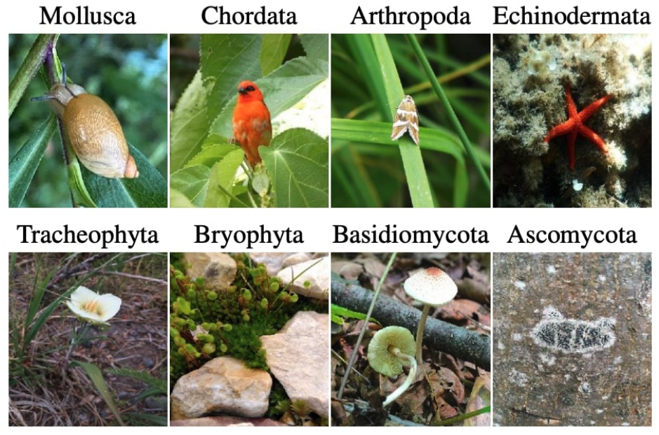
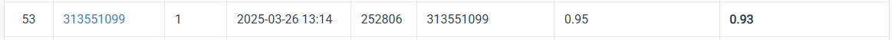

# HW1: Image Classification

## Links
- [Link to the dataset](https://drive.google.com/file/d/1fx4Z6xl5b6r4UFkBrn5l0oPEIagZxQ5u/view?pli=1)
- [Link to the competition](https://www.codabench.org/competitions/5901/?secret_key=b07a4812-f484-47c1-bd5e-304daba21d07)
  
## Introduction
- **Task**: Image classification.
- **Dataset**:
  - 21,024 training/validation images.
  - 2,344 test images.
  - 100 classes.
- **Model Requirements**:
  - Use a ResNet-based backbone (modifications allowed).
  - Total parameters must be under 100M.
- **My Approach**:
  - Modified ResNet101 (with experiments on other ResNet variants).
  - Data augmentation techniques: AutoAugment, CutMix, Random Erasing, etc.
  - Training strategies: Label Smoothing, dynamic learning rate scheduling, Test Time Augmentation.

## How to Install
Follow these steps to set up the development environment:

1. **Create and Activate a Conda Environment**
   ```
   conda create --name cvhw1 python=3.9 -y
   conda activate cvhw1
   ```
2. **Install PyTorch with CUDA Support**
    ```
   conda install pytorch torchvision torchaudio pytorch-cuda=12.1 -c pytorch -c nvidia -y
    ```
3. **Install Additional Packages**
    ```
   conda install numpy pandas matplotlib tqdm scikit-learn tensorboard -y
   pip install albumentations opencv-python
   pip install torchmetrics torchinfo
    ```

## How to Run
### Training
```
python train.py
```
### Inference
```
python inference.py
```
## Performance Snapshot

