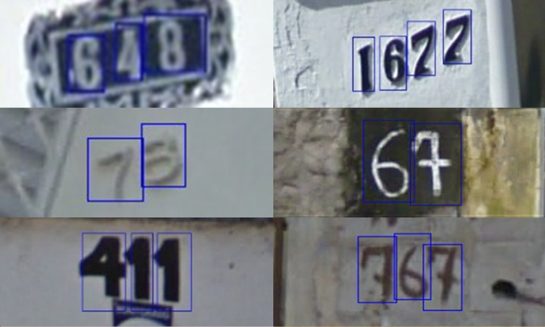
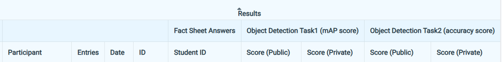
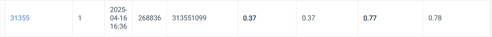

# HW2: Digit Recognition


## Links
- [Link to the dataset](https://drive.google.com/file/d/13JXJ_hIdcloC63sS-vF3wFQLsUP1sMz5/view)
- [Link to the competition](https://www.codabench.org/competitions/6724/?secret_key=fd223578-35a3-45db-9248-410fa8eb73f3)
- [Link to the spec](https://docs.google.com/presentation/d/1nrVyofHw3icwmLxEdUTHRZ_uZRAnr02zshddJcvXFfk/edit?slide=id.g33b1fcaa404_0_0#slide=id.g33b1fcaa404_0_0)
  
## Introduction
- **Task**: Digit Recognition  
  - **Sub-task 1**: Detect each digit with bounding boxes & class labels  
  - **Sub-task 2**: Reconstruct the digit sequence (e.g. “49”) left-to-right

- **Dataset**:  
  - Train/Val: 30,062 / 3,340 RGB images (COCO format `[x_min, y_min, w, h]`, class IDs 1–10)  
  - Test: 13,068 images

- **Model Requirements**:  
  - Use Faster R-CNN (backbone, RPN, head can be modified)  
  - No external data; pretrained weights OK  
  - Outputs: `pred.json` (detections) & `pred.csv` (image_id + digit string)

- **My Approach**:  
  - **Data Pre‑processing**:  
    - Resize short side to 256 px, adjust boxes accordingly  
    - Color jitter (set contrast value)  
  - **Model**:  
    - ResNet101‑FPN backbone  
    - Custom head for 11 classes (background + digits 0–9)  
  - **Training**:  
    - OneCycleLR (max_lr=0.005), batch size=8, epochs=22  
    - Save top‑3 checkpoints by validation loss  
  - **Inference**:  
    - Threshold = 0.7 to reduce duplicates  
    - Back‑scale boxes to original size  


## How to Install
Follow these steps to set up the development environment:

1. **Create and Activate a Conda Environment**
   ```
   conda create --name cvhw1 python=3.9 -y
   conda activate cvhw1
   ```
2. **Install PyTorch with CUDA Support**
    ```
   conda install pytorch torchvision torchaudio pytorch-cuda=12.1 -c pytorch -c nvidia -y
    ```
3. **Install Additional Packages**
    ```
   conda install numpy pandas matplotlib tqdm scikit-learn tensorboard -y
   pip install albumentations opencv-python
   pip install torchmetrics torchinfo
    ```

## How to Run
### Training
```
python train.py
```
### Inference
```
python inference.py
```
## Performance Snapshot


