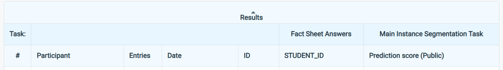
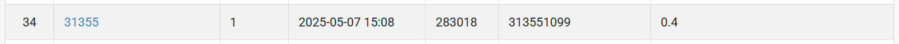

# HW3: Instance Segmentation of Histopathology Cells


## Links
- [Link to the dataset](https://drive.google.com/file/d/1B0qWNzQZQmfQP7x7o4FDdgb9GvPDoFzI/view)
- [Link to the competition](https://www.codabench.org/competitions/7325/?secret_key=68db3785-cb67-4dc0-b1d9-629b9d06e852)
- [Link to the spec](https://docs.google.com/presentation/d/1ye-KS7_QXoFE-EvF4E7ecmVv04JyPxI2Q4WpjRmjk-Y/edit#slide=id.g33b1fcaa404_0_0)
  
## Introduction

This repository contains a **Mask R‑CNN** pipeline (implemented with Detectron2) for 4‑class instance segmentation on coloured medical images.  The workflow is split into three simple scripts:

| File                 | Purpose                                                                                                                                                        |
| -------------------- | -------------------------------------------------------------------------------------------------------------------------------------------------------------- |
| **`annotations.py`** | Convert raw `.tif` images & masks into a single COCO‑style `train.json` file.                                                                                  |
| **`train.py`**       | Register the dataset, build a customised Mask R‑CNN (ResNet‑101‑DC5 backbone) and train it with data‑augmentation, best‑checkpoint selection and loss logging. |
| **`inference.py`**   | Load the best checkpoint, run inference on the test set, export predictions to `test‑results.json`, and save visual overlay images for sanity‑check.           |

Key features:

* Small‑scale anchors for tiny nuclei, colour & rotation augmentation.
* Automatic loss curve generation and *best AP* checkpointing.
* Final predictions already in the required COCO format.

---

## Installation

```bash
# Python ≥ 3.8
conda create -n cellseg python=3.9 -y
conda activate cellseg

# Core dependencies
pip install torch torchvision torchaudio --index-url https://download.pytorch.org/whl/cu118
pip install "git+https://github.com/facebookresearch/detectron2.git"

# Utility packages
pip install numpy pillow scikit-image pycocotools tqdm matplotlib
```

> **GPU** : Code has been tested on a single RTX 3090 (24 GB).  For CPU‑only inference, edit `inference.py` and set `DEVICE = "cpu"`.

---

## Dataset preparation

```
<dataset_root>/
├── train/
│   ├── 0001/
│   │   ├── image.tif
│   │   ├── class1.tif
│   │   ├── class2.tif
│   │   ├── class3.tif
│   │   └── class4.tif
│   └── ...
└── test/
    └── *.tif / *.png
```

**Generate COCO annotations**

   ```bash
   python annotations.py  # edit DATASET_ROOT inside if needed
   ```

   This creates `train.json` inside `<dataset_root>`.

---

## Training

```bash
python train.py
```

---

## Inference

```bash
python inference.py
```

---

## References

* K. He *et al.*, **“Mask R‑CNN.”** ICCV 2017.
* S. Ren *et al.*, **“Faster R‑CNN.”** NeurIPS 2015.
* K. He *et al.*, **“Deep Residual Learning.”** CVPR 2016.
* Y. Wu *et al.*, **Detectron2** (2019) – [https://github.com/facebookresearch/detectron2](https://github.com/facebookresearch/detectron2)

## Performance Snapshot


