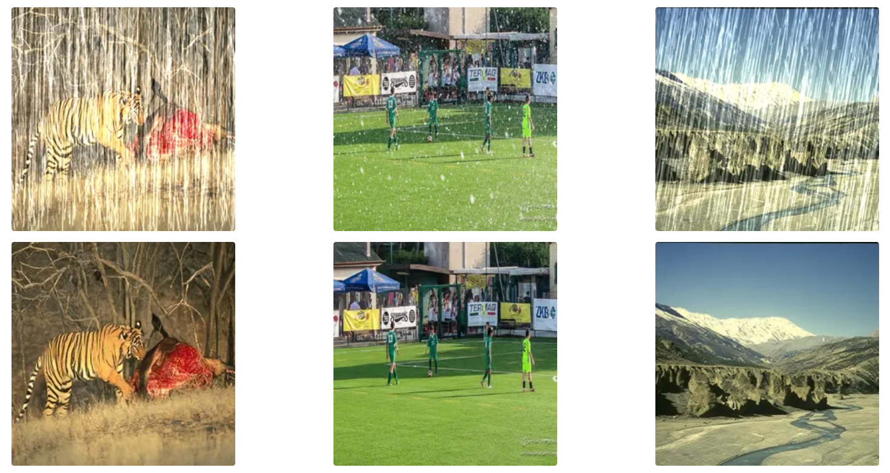
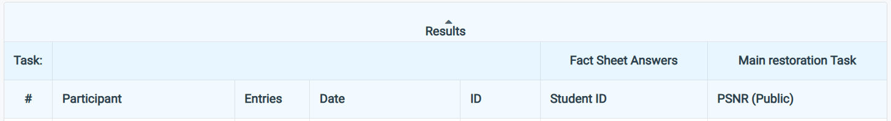
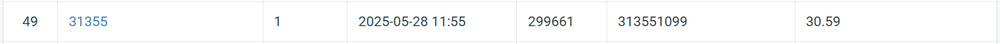

# HW4: PromptIR for Blind Image Restoration (Rain & Snow)



## Links
- [Link to the dataset](https://drive.google.com/drive/folders/1Q4qLPMCKdjn-iGgXV_8wujDmvDpSI1ul)
- [Link to the competition](https://www.codabench.org/competitions/7834/?secret_key=3ee0f511-d399-4221-b897-98cb11701cb6)
- [Link to the spec](https://docs.google.com/presentation/d/1wNV44N7lrMXa0DYy0ejkJ5skuEAImASBCqlGdqV0pow/edit?slide=id.g3531696fc91_0_0#slide=id.g3531696fc91_0_0)

## Introduction

This repository implements the **PromptIR** model for blind image restoration, specifically targeting rain and snow degradation types. The training and inference pipeline adheres to the official PromptIR design (CVPR 2023), modified with warm-up learning rate scheduling, EMA stabilization, and detailed training diagnostics.

---

## 📁 Files and Workflow

| File            | Purpose                                                                            |
| --------------- | ---------------------------------------------------------------------------------- |
| `config.yaml`   | Contains all training hyperparameters including learning rate, loss, etc.          |
| `dataloader.py` | Loads and augments paired (degraded, clean) images with synchronized transforms.   |
| `train.py`      | Main training script with warm-up scheduler, EMA, early-stopping, and logging.     |
| `model.py`      | Defines the PromptIR transformer-based restoration model with prompt conditioning. |
| `inference.py`  | Loads a trained checkpoint and generates a `pred.npz` file for submission.         |

---

## 🔍 Key Features

* Blind restoration of **rain** and **snow** degradation using a unified PromptIR architecture.
* **Warm-up + Cosine LR schedule** for stable convergence.
* **EMA (Exponential Moving Average)** starts after 10 epochs to smooth updates.
* Automatic **loss / PSNR curve visualization** and logging.
* Generates **`pred.npz`** conforming to the evaluation server format.
* Visualization of restored images + `.zip` packing utility in `inference.py`.

---

## ⚙️ Installation

```bash
conda create -n promptir python=3.9 -y
conda activate promptir

# Core dependencies
pip install torch torchvision torchaudio
pip install numpy pillow opencv-python matplotlib albumentations tqdm PyYAML
pip install torchmetrics
```

> ✅ GPU Tested: NVIDIA RTX 3090 (24 GB). For CPU-only inference, set `CUDA_VISIBLE_DEVICES=""` or modify `inference.py` accordingly.

---

## 📂 Dataset Structure

```
dataset/
├── train/
│   ├── degraded/      # e.g., rain-123.png, snow-456.png
│   └── clean/         # e.g., rain_clean-123.png, snow_clean-456.png
└── test/
    └── degraded/      # e.g., 0.png to 99.png (no label)
```

---

## 🚀 Training

```bash
python train.py --config config.yaml
```

Key options:

* `--val_ratio 0.1`  Validation split ratio (default = 10%)
* Automatic early stopping + best checkpoint (`best.pth`) saving

---

## 📤 Inference & Submission

```bash
python inference.py \
    --ckpt checkpoints/best.pth \
    --test_dir dataset/test/degraded \
    --out results/0528
```

* Saves `pred.npz` for submission.
* First 10 output images saved as `.png` for visual inspection.
* Automatically zips `pred.npz` as `0528.zip`


---

## 📈 Performance Snapshot




---

## 📄 References

* Yi, X. et al. [Prompting for All-in-One Blind Image Restoration (CVPR 2023)](https://arxiv.org/abs/2306.13090)
* Official GitHub: [https://github.com/va1shn9v/PromptIR](https://github.com/va1shn9v/PromptIR)
* Albumentations library: [https://albumentations.ai/](https://albumentations.ai/)
* Torchmetrics: [https://torchmetrics.readthedocs.io/](https://torchmetrics.readthedocs.io/)

